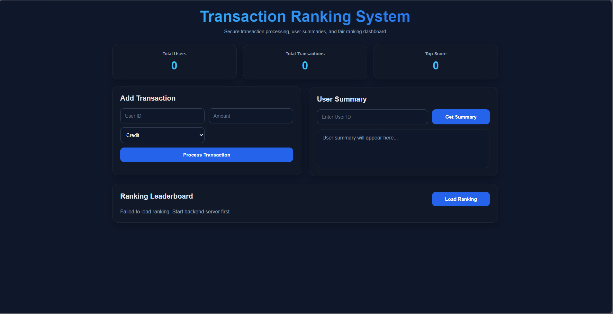

# 🚀 Transaction Ranking System

A full-stack **Transaction Ranking System** built with **Node.js, Express.js, MongoDB Atlas, and Vanilla JavaScript**. The application processes financial transactions, prevents duplicate requests using **Idempotency Keys**, calculates user scores, and generates a real-time ranking leaderboard. The project is deployed on **Vercel** with **MongoDB Atlas** as the cloud database.

---

## 🌐 Live Demo

**Live Application:**
https://transaction-ranking-system-lja61vj0x-vv21.vercel.app/

**GitHub Repository:**
https://github.com/vikas-chaurasia21/transaction-ranking-system

---

## ✨ Features

* Process Credit & Debit Transactions
* User Summary Dashboard
* Dynamic Ranking Leaderboard
* Real-Time Score Calculation
* Duplicate Transaction Prevention using Idempotency Keys
* RESTful API Architecture
* MongoDB Atlas Cloud Database
* Responsive Dashboard UI
* Full Stack Deployment on Vercel

---

## 🛠 Tech Stack

### Frontend

* HTML5
* CSS3
* Vanilla JavaScript

### Backend

* Node.js
* Express.js
* REST APIs

### Database

* MongoDB Atlas
* Mongoose ODM

### Deployment

* Vercel
* MongoDB Atlas

---

## 📂 Project Structure

```bash
transaction-ranking-system/
│
├── api/
│   └── index.js
│
├── Backends/
│   ├── config/
│   ├── controllers/
│   ├── middleware/
│   ├── models/
│   ├── routes/
│   ├── utils/
│   ├── server.js
│   ├── package.json
│   └── .gitignore
│
├── Frontends/
│   ├── index.html
│   ├── style.css
│   └── script.js
│
├── screenshots/
├── package.json
├── vercel.json
└── README.md
```

---

## 🔗 REST API Endpoints

### Process Transaction

```http
POST /api/transaction
```

Request Body

```json
{
  "userId": "vikas",
  "amount": 5000,
  "type": "credit",
  "idempotencyKey": "vikas-5000-credit"
}
```

---

### Get User Summary

```http
GET /api/summary/:userId
```

Example

```http
GET /api/summary/vikas
```

---

### Get Ranking Leaderboard

```http
GET /api/ranking
```

---

## 🧠 Ranking Logic

The ranking score is calculated using:

* Total Credits
* Total Debits
* Number of Transactions

Users with higher transaction activity receive a higher ranking score.

---

## 🔒 Duplicate Transaction Prevention

Each transaction is protected using an **Idempotency Key**.

Example:

```text
vikas-5000-credit
```

Duplicate requests with the same key are rejected to prevent duplicate transaction processing.

---

## ⚙️ Installation

Clone the repository

```bash
git clone https://github.com/vikas-chaurasia21/transaction-ranking-system.git
```

Install dependencies

```bash
cd Backends
npm install
```

Create a `.env` file

```env
MONGO_URI=your_mongodb_connection_string
```

Run the backend

```bash
npm run dev
```

Open the frontend

```text
Frontends/index.html
```

or run using **Live Server**.

---

## 📸 Screenshots

### Dashboard



---

## 👨‍💻 Author

**Vikas Chaurasia**

B.Tech CSE | Full Stack Developer | Software Engineering Enthusiast

* GitHub: https://github.com/vikas-chaurasia21
* LinkedIn: https://www.linkedin.com/in/vikas-chaurasia-86765b211/

---

⭐ If you found this project useful, consider giving it a **Star** on GitHub.
